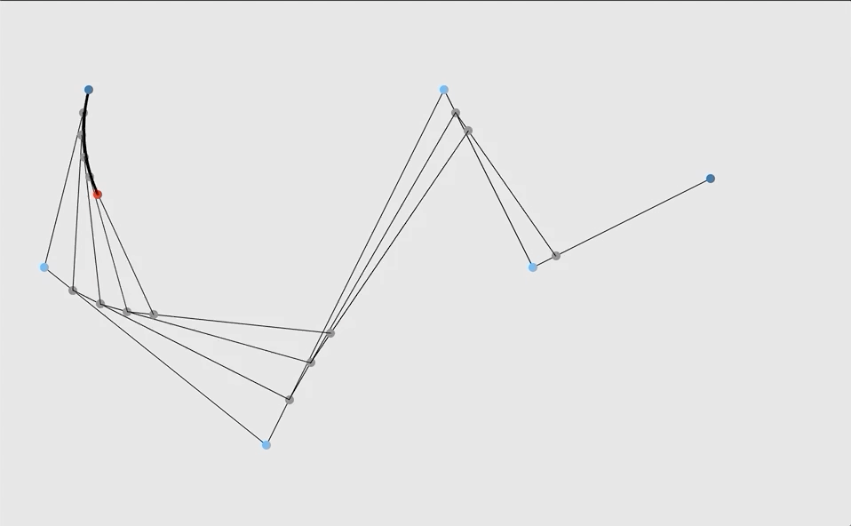
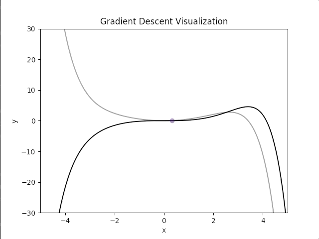

# Adham's Wiki

Personal library for data science and analysis using python3 and javascript.

--The regression folder has my personal base templates for rudimentary linear/polynomial regression in python.

\*This repository is a combination of my own work and code I wrote through the aid of online resources. I do not claim full credit for all work in this repository, nor do I actively support or maintain it. Anyone is free to use it, but I suggest using it as a base outline rather than a product, as that is what I created it for.

## Demos

Bezier Curves of N order \(js\) 

Particle Playground \(py\) 

Dynamic Gradient Descent \(py\) 

