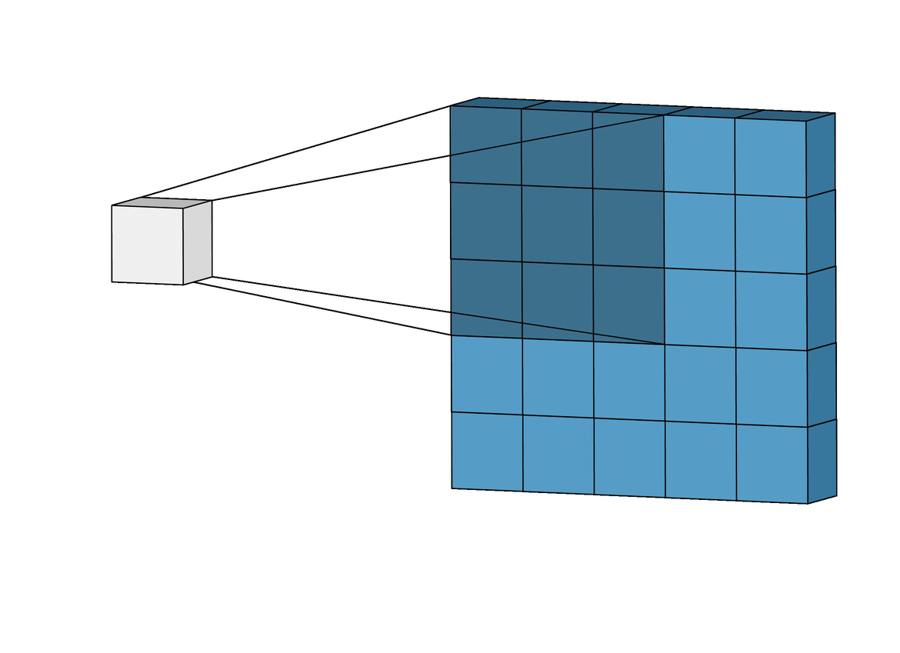

# Cool Intuition

While developing my understanding of machine learning, I found the following points to be intellectually stimulating and interesting. 

### Why do artificial neurons have continuous activations instead of being active/inactive in a binary way -- the way that biological neurons are?

The heart of training neural networks is just minimizing some cost/loss function. The methods used to minimize the loss function \([Backpropagation](neural-networks/backward-propagation.md), [Optimizers](neural-networks/optimizers.md), Gradient Descent\) are rooted in being able to  compute derivatives on our loss function, which means that it must be a relatively nice and smooth function. If the artificial neurons were binarily activated, then the resultant loss function would have many discontinuities.

### Why do we normalize datasets pre-training?

Normalization is a simple rescaling of the data from the original range so that all values are within the range of 0 and 1. This is done so that the values don't blow up within the hidden layers of the neural network due to all the linear combinations. 

### Why do we add nonlinear activation functions to neural networks?

This question boils down to why we even need to think about activation functions. Why can't we just feed in the _raw_ output of the previous layer into the current layer? Well, a perceptron \(neuron\) is simply an abstraction of a linear computation: `some value * weight + bias` . No matter how many layers we have, if they are all linear in nature, the final activation function of the last layer is nothing but a linear function of the input of the first layer. AKA, if we just have multiple layers of linear functions, they can be replaced with a single layer that does the exact same thing. Thus, we need to add a nonlinear activation function to each perceptron in order to allow the model to scale complexity.

### Why can fully convolutional models accept variable input dimensions? Why can't any model with dense layers?

The reason is that when using a convolutional layer, you select the size of the _filter kernels_, which are independent of the image/layer input size \(provided that images smaller than the kernels are padded appropriately\).

When using a dense layer, you specify the size of the layer itself and the resulting weight matrix is a function of both the size of the dense layer and the upstream layer. This is because each neuron in the upstream layer makes a connection to each neuron in the dense layer. So, if you have 50 neurons in the upstream layer and 20 neurons in the dense layer, then the weight matrix has 50×20=100050×20=1000 values. Those weights are what get determined during the training phase, and so those layer sizes are fixed.

Now, the output of a CNN layer is a number of images/tensors \(specified by the number of filters chosen\), whose size is determined by the kernel size and any padding option chosen. If those are fed into a dense layer, then that fixes the the size that those images can be \(because of the reason given in the previous paragraph\).

On the other hand, if no dense layer is used in the whole network, then the input to the first CNN layer can be any size because the weights are just the individual parameters of the filter kernels, and the filter kernels remain the same size regardless of the input tensor size.

### Some useful equations:

$$
u_L[n] = \frac{v^* + \beta_L}{\theta_L} - \frac{k_L}{\theta_L}\delta[n]
$$

$$
u_R[n] = \frac{v^* + \beta_R}{\theta_R} + \frac{k_R}{\theta_R}\delta[n]
$$

$$
\delta[n]_{straight}= d_L[n] - d_R[n]
$$

$$
\delta[n]_{turn} = f(r, v^*, l, n)
$$

$$
\newline
\delta[n]_{turn} = \frac{v^*n}{r}\cdot(r+\frac{l}{2}) - \frac{v^*n}{r}\cdot(r-\frac{l}{2})
$$

