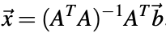

# Least Squares

It is extremely improbable that a fully-defined full-rank system and raw measurements will result in an exact solution.It is often the case that the equations we receive may be corrupted slightly by noise. When we have a large number of equations, the result is an inconsistent system, where no x exists that satisfies all the equations exactly. 

